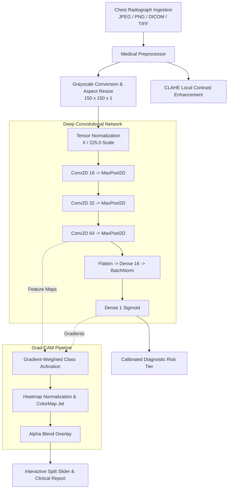

# PneumoScan AI: Production Chest Radiograph Diagnostic Intelligence

[](https://fastapi.tiangolo.com)
[](https://tensorflow.org)
[](https://python.org)
[](https://www.docker.com/)
[](LICENSE)

An end-to-end, clinical-grade medical computer vision platform for automated detection of **Pneumonia** in Chest Radiographs (X-Rays). Features high-resolution **Grad-CAM (Gradient-weighted Class Activation Mapping)** for explainable AI, a **FastAPI REST API**, an interactive **radiology web dashboard** with before/after split wipes, and an upgraded **desktop consultation workstation**.

---

## Key Features

- **Explainable AI (Grad-CAM):** Synthesizes thermal activation overlays on the final convolutional layer (`conv2d_2`), localizing consolidation and pulmonary infiltrates for clinician verification.
- **Interactive Split Slider:** Web dashboard includes a real-time horizontal wipe slider to seamlessly compare raw radiograph anatomy against the neural activation heatmap.
- **Dual Interface Delivery:**
  - **Web Dashboard:** Pure HTML5/CSS3/JavaScript responsive interface with dark clinical aesthetics, CLAHE contrast equalization, negative inversion, and PDF report export.
  - **Desktop Client (`myApp.py`):** Crash-resilient Tkinter application with dual preview canvases and diagnostic telemetry.
- **Production REST API:** High-throughput async FastAPI service with OpenAPI/Swagger docs (`/docs`), automated Pydantic schema validation, and health monitoring.
- **Docker & Container Ready:** Multi-stage `Dockerfile` and `docker-compose.yml` pre-configured for one-command deployment.

---

## Architectural Workflow



---

## Quickstart Guide

### 1. Local Environment Setup

```bash
# Clone repository
git clone https://github.com/R-Priyadarshi/disease-detection-system.git
cd disease-detection-system

# Create and activate virtual environment
python3 -m venv .venv
source .venv/bin/activate

# Install production dependencies
pip install -r requirements.txt
```

### 2. Launch the Web Application & REST API

```bash
# Start FastAPI diagnostic server
uvicorn api.app:app --host 0.0.0.0 --port 8000 --reload
```
Open your browser to:
- **Web Dashboard:** `http://localhost:8000`
- **Interactive API Documentation (Swagger):** `http://localhost:8000/docs`

---

### 3. Launch the Desktop Consultation Workstation

```bash
python myApp.py
```

---

### 4. Command-Line Inference (CLI)

```bash
# Analyze a radiograph and generate a Grad-CAM heatmap
python test.py --image core/assets/samples/sample_pneumonia.jpg --output-gradcam /tmp/pneumonia_heatmap.jpg
```

---

### 5. Run via Docker

```bash
# Using Docker Compose
docker-compose up -d --build

# Inspect service logs
docker-compose logs -f
```

---

## REST API Specification

| Method | Endpoint | Description |
| :--- | :--- | :--- |
| `GET` | `/health` | System healthcheck, hardware accelerator (CPU/GPU), and model status. |
| `POST` | `/api/v1/predict` | Multipart upload for radiograph analysis and Grad-CAM heatmap synthesis. |
| `GET` | `/api/v1/samples` | Returns verified sample normal and pneumonia radiographs. |
| `POST` | `/api/v1/report` | Formats a structured, printable clinical radiology consultation report. |

---

## Automated Test Suite

```bash
# Run pytest verification suite
pytest -v tests/
```

Test coverage includes:
- `tests/test_model.py`: Model architecture, layer parameters, and numerical range verification.
- `tests/test_gradcam.py`: Gradient backpropagation, heatmap dimensions, and overlay blending.
- `tests/test_api.py`: FastAPI endpoints (`/health`, `/api/v1/predict`, `/api/v1/samples`, `/api/v1/report`).

---

## Medical Disclaimer

This software is an educational and research decision-support tool. It is not intended as a primary medical diagnostic device and must always be correlated with clinical findings by a certified radiologist or healthcare provider.
