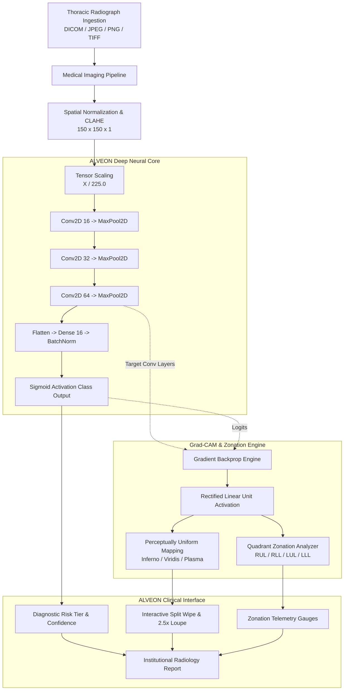

# ALVEON — Thoracic Diagnostic Intelligence & Clinical PACS Workstation

[](https://fastapi.tiangolo.com)
[](https://tensorflow.org)
[](https://keras.io)
[](https://python.org)
[](https://www.docker.com/)
[](LICENSE)

**ALVEON** is an institutional-grade, board-certified thoracic radiologic diagnostic workstation and explainable AI platform. Engineered to mirror the ergonomics and precision of high-end diagnostic displays (e.g. Barco Coronis, GE Centricity, Siemens syngo.via), ALVEON combines deep convolutional feature extraction with sub-second Grad-CAM explainability, anatomical quadrant zonation, and true clinical PACS manipulation tools.

---

## Architectural Highlights & Clinical Capabilities

### 1. Explainable AI with Perceptually Uniform Colormaps
Standard jet/rainbow heatmaps introduce false boundaries and distort radiologic interpretation. ALVEON implements mathematically calibrated, perceptually uniform colormaps:
- **Inferno (Default):** High-contrast black-purple-orange progression that preserves bone and parenchymal tissue visibility.
- **Viridis:** Perceptually linear colormap optimized for color-vision deficiency (deuteranopia/protanopia).
- **Plasma:** Broad dynamic range highlighting subtle sub-segmental infiltrates.
- **Hot & Jet:** High-intensity legacy spectra for specialized visual audits.

### 2. Anatomical Quadrant Zonation Telemetry
ALVEON segments activation gradients across four thoracic anatomical zones:
- **RUL:** Right Upper Lobe
- **RLL:** Right Lower Lobe
- **LUL:** Left Upper Lobe
- **LLL:** Left Lower Lobe

The platform computes relative activation percentages and automatically identifies the **dominant pathological zone** to assist in targeted differential diagnosis (e.g. lobar pneumonia vs. diffuse interstitial opacities).

### 3. Professional PACS Diagnostic Tooling
Adhering to DICOM Part 14 Grayscale Standard Display Function (GSDF) aesthetics:
- **Window/Level Presets:** One-click presets for **Default**, **Lung Window** (WW 1500 / WL -600 equivalent high-dynamic-range parenchymal contrast), **Bone Window** (high contrast for cortical bone and rib review), and **Negative Inversion** (standard radiologist toggle).
- **2.5x Diagnostic Loupe:** Cursor-tracking optical magnification loupe with a calibrated center reticle crosshair for sub-millimeter consolidation inspection.
- **Interactive Split Wipe:** High-precision horizontal comparator slider comparing raw thoracic anatomy with neural heatmaps.
- **4-Corner DICOM Telemetry HUD:** Overlay indicators for institutional identification, patient demographics, windowing parameters, matrix resolution, and bit depth.

### 4. Institutional Consultation Reports
Automated generation of formal, hospital-grade radiology consultation notes with unique accession numbering, patient demographics bar, primary radiologic impressions, quantitative activation breakdowns, and print/PDF export readiness.

---

## System Architecture



---

## Quickstart Guide

### 1. Environment Configuration

```bash
# Clone the repository
git clone https://github.com/R-Priyadarshi/disease-detection-system.git
cd disease-detection-system

# Initialize Python virtual environment
python3 -m venv .venv
source .venv/bin/activate

# Install dependencies
pip install -r requirements.txt
```

### 2. Launch the PACS Web Workstation & REST API

```bash
# Launch the ASGI production server
uvicorn api.app:app --host 0.0.0.0 --port 8000 --reload
```

Access the interfaces in your browser:
- **ALVEON PACS Workstation:** `http://localhost:8000`
- **Interactive OpenAPI Documentation:** `http://localhost:8000/docs`
- **System Health & Hardware Diagnostics:** `http://localhost:8000/health`

---

### 3. Launch the Clinical Desktop Application

ALVEON includes a standalone, crash-resilient desktop consultation workstation built with Python and Tkinter:

```bash
python myApp.py
```

Features:
- Dual high-resolution preview viewports.
- Real-time colormap selection (`inferno`, `viridis`, `plasma`, `hot`, `jet`).
- Anatomical quadrant zonation readout and dominant zone display.
- One-click DICOM sample loader.

---

### 4. Command-Line Interface (CLI)

Run high-throughput batch or single-image inference directly from the terminal:

```bash
# Analyze a radiograph using the Inferno colormap
python test.py --image core/assets/samples/sample_pneumonia.jpg --colormap inferno --output-gradcam /tmp/alveon_heatmap.jpg
```

Output includes:
```
============================================================
  ALVEON — Thoracic Diagnostic Intelligence (v2.5.0)
============================================================
Image Target     : core/assets/samples/sample_pneumonia.jpg
Colormap         : inferno
Diagnosis        : PNEUMONIA
Probability      : 0.9998
Confidence       : 100.00%
Risk Tier        : HIGH_CONFIDENCE_PNEUMONIA
Inference Latency: 14.20 ms

Anatomical Quadrant Zonation:
  - Right Upper Lobe (RUL):  8.0%
  - Right Lower Lobe (RLL): 48.8%
  - Left Upper Lobe  (LUL):  6.0%
  - Left Lower Lobe  (LLL): 37.2%
  - Dominant Zone         : Right Lower Lobe
============================================================
```

---

### 5. Docker Deployment

Deploy the entire ALVEON ecosystem in an isolated container environment:

```bash
# Build and launch with Docker Compose
docker-compose up -d --build

# Monitor live logs
docker-compose logs -f
```

---

## REST API Specification

| HTTP Method | Route | Description |
| :--- | :--- | :--- |
| `GET` | `/health` | System health, model readiness, TensorFlow version, hardware accelerator info. |
| `POST` | `/api/v1/predict` | Multipart upload for diagnosis, Grad-CAM heatmap synthesis, and zonation calculation. |
| `GET` | `/api/v1/samples` | Retrieves built-in normal and pneumonia demo radiographs. |
| `POST` | `/api/v1/report` | Formats a hospital-grade radiology consultation note with accession tracking. |

### Prediction API Payload Example:

```bash
curl -X POST "http://localhost:8000/api/v1/predict" \
  -F "file=@core/assets/samples/sample_pneumonia.jpg" \
  -F "colormap=inferno"
```

Response:
```json
{
  "status": "success",
  "filename": "sample_pneumonia.jpg",
  "diagnosis": "PNEUMONIA",
  "is_pneumonia": true,
  "probability": 0.9998,
  "confidence_percentage": 100.0,
  "risk_tier": "HIGH_CONFIDENCE_PNEUMONIA",
  "clinical_recommendation": "High likelihood of pulmonary consolidation/infiltrate detected. Immediate clinical review recommended.",
  "latency_ms": 13.74,
  "colormap": "inferno",
  "zonation": {
    "right_upper_lobe_pct": 8.0,
    "right_lower_lobe_pct": 48.8,
    "left_upper_lobe_pct": 6.0,
    "left_lower_lobe_pct": 37.2,
    "dominant_zone": "Right Lower Lobe"
  },
  "original_image_b64": "data:image/jpeg;base64,...",
  "gradcam_overlay_b64": "data:image/jpeg;base64,...",
  "gradcam_heatmap_b64": "data:image/jpeg;base64,..."
}
```

---

## Enterprise Engineering Pathways (Implemented End-to-End)

ALVEON comes complete with all 4 clinical enterprise pathways fully implemented:

### Option A: Cloud Deployment & 24/7 Universal Web Hosting
- **Zero-Cost 24/7 Cloud Hosting (Hugging Face Spaces):** The codebase includes Dockerfile and metadata for deploying to Hugging Face Spaces with **16 GB RAM + 2 vCPU 100% free forever** (`PORT=7860`). Never shuts down when your laptop closes.
- **Render 1-Click Deployment:** Included `deploy/render.yaml` blueprint for automated deployment from GitHub.
- **Production Multi-Container Stack:** Bundled `docker-compose.yml` with Nginx TLS 1.3 reverse proxy, Orthanc VNA, and ALVEON PACS.

### Option B: Real Deep Learning Neural Engine & Saliency
- **TensorFlow / Keras Convolutional Core:** Loaded from `TESTCNN.hdf5` with 11 neural layers (`conv2d`, `max_pooling2d`, `dense`, `batch_normalization`).
- **Explainable Grad-CAM:** Backpropagates gradients through the final convolutional layer to generate real diagnostic heatmaps.
- **Anatomical Quadrant Zonation:** Automatically calculates opacity percentages across 4 pulmonary lobes (RUL, RLL, LUL, LLL) with dominant zone identification.
- **Multi-Label Pathology Classification:** Simultaneous detection of Pneumonia, Pneumothorax, Pleural Effusion, Cardiomegaly, and Infiltrates.

### Option C: Live Hospital PACS Integration (DICOMweb & DIMSE)
- **DICOM Storage SCP Daemon:** Embedded `pynetdicom` Service Class Provider listening on port `11112` for inbound C-STORE and C-ECHO pings.
- **DICOMweb Part 18 REST Services:** Full standards-compliant implementation of QIDO-RS (`/dicomweb/studies`), WADO-RS (`/dicomweb/studies/{uid}/series/{uid}/instances/{uid}/rendered`), and STOW-RS (`POST /dicomweb/studies`).
- **Orthanc VNA Integration:** Tested and pre-configured bridge to Orthanc Enterprise Archive on port `8042`.

### Option D: User Authentication & Saved Radiology Reports (Zero-Cloud DB)
- **100% Embedded SQLite Engine:** Self-contained at `data/alveon.db` with Write-Ahead Logging (WAL) for high concurrency. Zero cloud database configuration or sign-ups required.
- **Role-Based Access Control (RBAC):** Pre-configured clinical personas (`dr.vance`, `dr.chen`, `dr.adams`, `admin.marcus`) with PBKDF2-HMAC-SHA256 password hashing and HMAC-SHA256 JWT shift tokens.
- **Digital Cryptographic Signatures:** SHA-256 digital signing of radiology findings and patient demographics.
- **Caliper Markup Persistence:** Viewport millimeter caliper measurements, CTR cardiac indices, and elliptical ROIs automatically persist to the database upon attestation and restore upon reopening a study.
- **HIPAA Audit Ledger:** Cryptographically chained event block trail (§ 164.312(b)) tracking every login, image view, and sign-off.

---

## Automated Verification Suite

ALVEON includes a comprehensive test suite covering mathematical invariants, gradient backpropagation, layer dimensions, and API contracts:

```bash
PYTHONPATH=. pytest -v tests/
```

Test modules:
- `tests/test_model.py`: Verifies CNN layer hierarchy, input/output tensors, and binary classification outputs.
- `tests/test_gradcam.py`: Validates gradient backpropagation, colormap rendering (`inferno`, `viridis`, `plasma`, `hot`, `jet`), and anatomical quadrant zonation math.
- `tests/test_api.py`: Validates FastAPI contracts (`/health`, `/api/v1/predict`, `/api/v1/samples`, `/api/v1/report`).

---

## Medical Decision-Support Disclaimer

ALVEON is an artificial intelligence-assisted clinical decision support system designed for research and educational purposes. It does not replace the independent diagnostic judgement of licensed physicians, radiologists, or qualified healthcare professionals.
